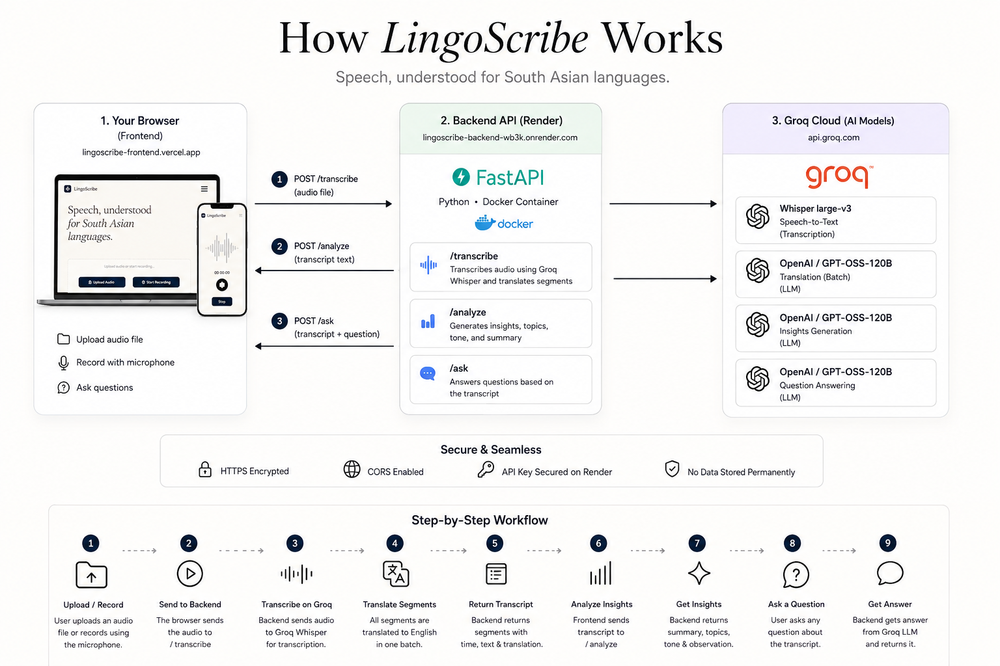

# LingoScribe — Frontend

AI-powered speech-to-text for Urdu and Punjabi. Upload any audio file or record live from your microphone — get instant transcription, English translation per segment, and AI insights. No signup, no build step.

**Live:** https://lingoscribe-frontend.vercel.app  
**How it works:** https://lingoscribe-frontend.vercel.app/how-it-works.html  
**Backend:** https://github.com/muhmdfarhan0/lingoscribe-backend

---

## Architecture



---

## Features

- Drag-and-drop or click-to-browse upload — WAV, MP3, OGG, FLAC, M4A, WEBM, OPUS, AAC, WMA, MP4
- Live microphone recording via `MediaRecorder` API with real-time timer
- Transcript table: timestamps, original Urdu/Punjabi text, English translation per segment
- AI insights auto-generated after transcription: summary, key topics, tone, speech observation
- Natural language Q&A about the transcript
- Mobile-responsive, zero dependencies, no build step

## Design

- Warm cream (`#F7F2E9`) background, deep navy (`#0F1E35`) accents
- Cormorant Garamond serif for headings, Inter for UI text
- Wave-loader animation during processing, staggered insight card reveal

## Pages

| Page | URL | Purpose |
|------|-----|---------|
| Main app | `/` | Audio upload, recording, transcription, insights, Q&A |
| How it works | `/how-it-works.html` | Architecture diagram and pipeline explanation |

## Running locally

No build step — open directly or serve statically:

```bash
# Python
python -m http.server 5500

# Node
npx serve .
```

The backend must be running at `http://localhost:8000`.  
See [lingoscribe-backend](https://github.com/muhmdfarhan0/lingoscribe-backend) for setup.

## Deployment (Vercel)

1. Update `API_URL` in `app.js` line 1 to your deployed backend URL
2. Connect this repo to [Vercel](https://vercel.com)
3. Framework: **Other** — no build command, output directory `/`

## Files

```
index.html            Main application
how-it-works.html     Architecture and pipeline explanation
style.css             Shared design system
how-it-works.css      Page-specific styles for how-it-works
app.js                Frontend logic — upload, recording, API calls
og-image.svg          Social preview card (1200×630)
how-it-works-diagram.png  Architecture diagram
robots.txt            Crawler rules
sitemap.xml           URL index for search engines
```

## Contact

- [GitHub](https://github.com/muhmdfarhan0)
- [LinkedIn](https://www.linkedin.com/in/muhammad-farhan07567)
- [Website](https://www.farhanai.online/contact)
